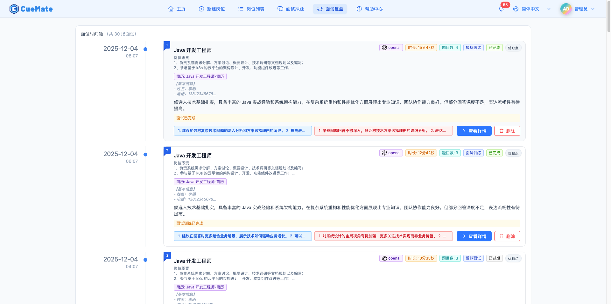

# CueMate - 智能语音面试助手

AI 驱动的实时面试训练工具

[English](docs/README.en.md) | 中文 | [文档](https://cuemate.chat) | [下载](https://github.com/cuemate-chat/cuemate/releases)

## 项目简介

CueMate 是一款开源的智能语音面试助手 - AI 驱动的实时面试训练工具，专注于帮助求职者通过系统化的模拟面试训练和面试准备，提升面试技能和表现。

## 核心优势

<table>
  <tr>
    <td align="center" valign="top" width="25%">
      
       <b>实时响应</b>
       语音识别延迟 < 200ms 答案生成 < 1.5 秒
    </td>
    <td align="center" valign="top" width="25%">
      
       <b>智能准确</b>
       24+ 主流 LLM 支持 RAG 知识库增强
    </td>
    <td align="center" valign="top" width="25%">
      
       <b>易于使用</b>
       一键安装部署 直观现代化界面
    </td>
    <td align="center" valign="top" width="25%">
      
       <b>隐私安全</b>
       本地部署运行 数据不外传
    </td>
  </tr>
</table>

## 核心功能

<table>
  <tr>
    <td valign="top" width="50%">
      <h3> AI 模拟面试</h3>
      
AI 扮演面试官角色，根据岗位 JD 自动提问并评估回答，提供完整的模拟面试体验。

    </td>
    <td valign="top" width="50%">
      <h3> 面试训练</h3>
      
实时识别面试官的问题，从知识库中检索相关答案，并给出专业的回答建议。

    </td>
  </tr>
  <tr>
    <td valign="top" width="50%">
      <h3> 语音提问</h3>
      
通过文字或语音向 AI 提问技术问题或面试题，快速获取专业答案建议。

    </td>
    <td valign="top" width="50%">
      <h3> 知识库增强</h3>
      
上传简历、岗位描述、面试押题到向量知识库，支持语义搜索，确保回答贴合真实背景。

    </td>
  </tr>
  <tr>
    <td valign="top" width="50%">
      <h3> 面试复盘</h3>
      
查看历史面试记录，分析回答质量，总结经验教训。

    </td>
    <td valign="top" width="50%">
      <h3> 多模型支持</h3>
      
支持 OpenAI、Claude、Gemini、DeepSeek、Kimi、智谱、通义千问等 24+ 种大语言模型，也支持本地 Ollama。

    </td>
  </tr>
</table>

## 应用场景

<table>
  <tr>
    <td align="center" valign="top" width="33%">
      <h3> 模拟面试训练</h3>
      
AI 根据岗位 JD 自动提问 评估回答给出改进建议 针对薄弱环节反复练习

    </td>
    <td align="center" valign="top" width="33%">
      <h3> 面试准备</h3>
      
上传简历项目文档建知识库 创建管理个性化面试题库 测试麦克风和扬声器设备

    </td>
    <td align="center" valign="top" width="33%">
      <h3> 技能提升</h3>
      
训练结构化表达 STAR 法则 模拟快速提问增强承受力 支持中英双语面试练习

    </td>
  </tr>
</table>

## 产品截图

<table>
  <tr>
    <td align="center" valign="top">
      
       <b>悬浮控制栏</b>
    </td>
    <td align="center" valign="top">
      
       <b>AI 模拟面试</b>
    </td>
  </tr>
  <tr>
    <td align="center" valign="top">
      
       <b>LIVE 面试训练</b>
    </td>
    <td align="center" valign="top">
      
       <b>面试复盘</b>
    </td>
  </tr>
</table>

## 快速开始

### 系统要求

| 项目 | 最低配置 | 推荐配置 |
|-----|---------|---------|
| 操作系统 | macOS 13.0 (Ventura) | macOS 15 (Sequoia) |
| 处理器 | Intel Core i5 双核 / Apple Silicon | Intel Core i7 四核 / M1 Pro+ |
| 内存 | 4GB RAM | 8GB RAM |
| 存储空间 | 10GB 可用空间 | 15GB 可用空间 |
| 必需软件 | Docker Desktop 4.0+（安装包已内置） | - |

### 下载安装

<table>
  <tr>
    <td align="center" width="50%">
      <h3> 百度网盘（推荐国内用户）</h3>
      

        <a href="https://pan.baidu.com/s/1cKVLf2_1BnRBgEkdL35K4Q?pwd=3477">点击下载</a>
         提取码：<code>3477</code>
      

    </td>
    <td align="center" width="50%">
      <h3> GitHub Release</h3>
      

        <a href="https://github.com/cuemate-chat/cuemate/releases">前往下载</a>
         适合海外用户
      

    </td>
  </tr>
</table>

### 安装步骤

1. 根据芯片类型下载对应的 DMG 安装包
2. 双击打开 DMG 文件，按照安装向导完成安装（约 5 分钟）
3. 使用内置账号登录（默认用户名：`admin`，密码：`cuemate`）

## 文档

| 文档 | 说明 |
|-----|------|
| [快速开始](https://cuemate.chat/guide/installation/quick-start) | 安装指南 |
| [功能手册](https://cuemate.chat/guide/features/) | 详细功能说明 |
| [版本说明](https://cuemate.chat/guide/changelog/) | 更新日志 |
| [常见问题](https://cuemate.chat/guide/faq/) | FAQ |

## 社区与支持

-  **问题反馈**：[GitHub Issues](https://github.com/cuemate-chat/cuemate/issues)
-  **功能建议**：[GitHub Discussions](https://github.com/cuemate-chat/cuemate/discussions)

## 开源协议

CueMate 基于 [GPL-3.0](LICENSE) 协议开源。